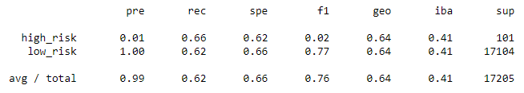
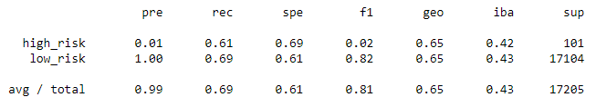
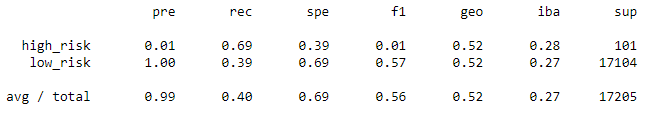
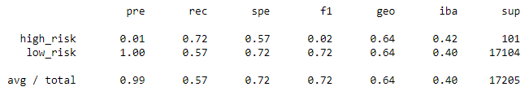
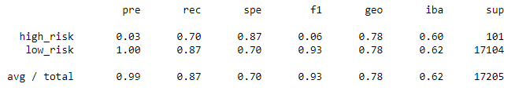
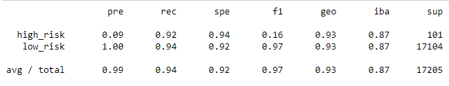
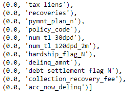

# Credit_Risk_Analysis

## Overview 

LendingClub, a peer-to-peer lending services company, would like to develop a few machine learning models to predict credit risk. Credit risk is an unbalanced since the number of good loans outnumber the risky loans. Multiple techniques will be employed to determine which model(s) perform better at predicting credit risk. The dataset was first oversampled using the RandomOverSampler and SMOTE. The dataset was then undersampled using ClusterCentroids. SMOTEENN algorithm was used next which combines both over- and undersampling of the data. 

## Results: 

### Naive Random Oversampling

- Accuracy: 0.643
- Precision and Recall (Sensitivity) are shown below:

### SMOTE Oversampling:
- Accuracy: 0.652
- Precision and Recall (Sensitivity) are shown below:

### Undersampling:
- Accuracy: 0.544
- Precision and Recall (Sensitivity) are shown below:

### SMOTEENN Combination Over-and Undersampling:
- Accuracy: 0.644
- Precision and Recall (Sensitivity) are shown below:

### Balanced Random Forest:
- Accuracy: 0.788
- Precision and Recall (Sensitivity) are shown below:

### Easy Ensemble AdaBoost Classifier:
- Accuracy: 0.931
- Precision and Recall (Sensitivity) are shown below:

## Summary

For this scenario, a higher sensitivity is more important than higher precision. Here, sensitivity is the measure of how many people who are high-risk were correctly categorized. It is better for the business to catch all of those who are high-risk rather than incorrectly categorizing them as low-risk. Those who are flagged as high-risk can undergo additional screening to determine if they qualify for credit or not. 

Overall, the ensembled learning models performed the best in regards to accuracy and sensitivity. All the models produced high precision for the low-risk detection and low precision for the high-risk detection. This is due to the imbalanced nature of the dataset i.e. there are far more low-risk applicants than high-risk. 

The SMOTEENN model, which combines the over and undersamplimg methods were better than the individual oversampling and undersampling models. The SMOTE model is highly influenced by outliers and might explain why it had the worst recall. 

Overall, I wouldn't select any of the models since the F1 score is too low for the high-risk detection. I would try other types of ensemble learners and see if there is a better model. The ensemble learners aggregate multiple models, making it more robust. As we can see, the highest accuracy models were the ensemble learning models. By ranking the feature importance, we can see there are quite a few features that can be dropped (such as hardship_flag_N, delinq_amnt, debt_settlement_flag_N, collection_recovery_fee, acc_now_delinq). Once those features are dropped, these ensemble learning models can be rerun to see if there is a better fitting model. 

